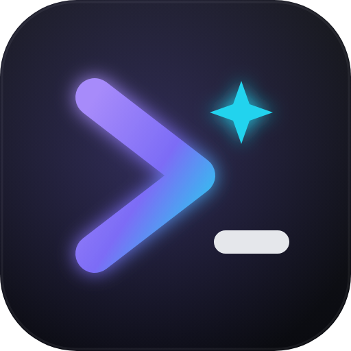
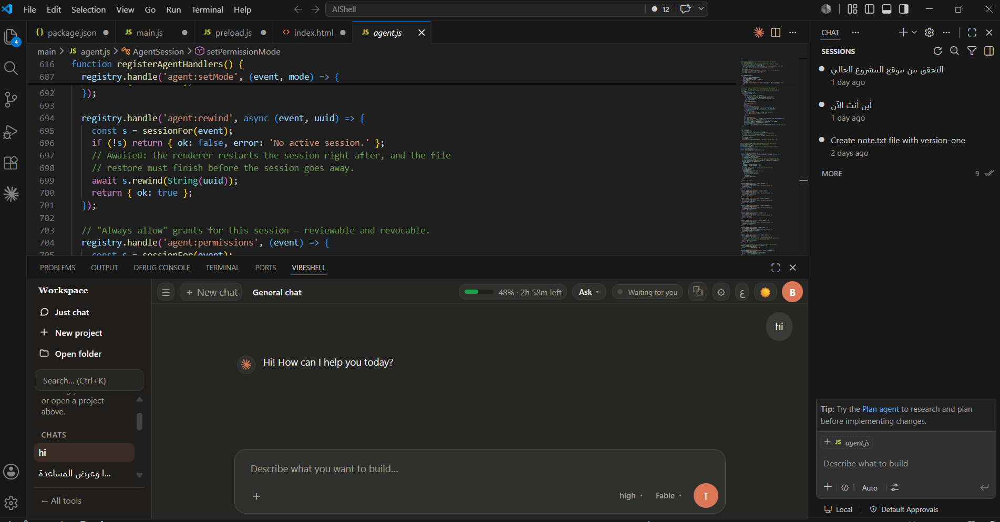

<div align="center">



# VibeShell

**The AI terminal you never have to learn.**

Run [Claude Code](https://www.anthropic.com/claude-code) through a friendly graphical panel — inside your code editor or as a standalone desktop app. Describe what you want, review every change, and let the agent write the code. No terminal commands to memorize.

<br/>



<sub>*VibeShell as a panel inside VS Code — chat with the agent right beside your code.*</sub>

<br/>

[](https://github.com/bassamjabar/vibeshell/actions/workflows/ci.yml)
[](LICENSE)


[English](#english) · [العربية](#العربية)

</div>

---

## English

### What is VibeShell?

VibeShell wraps Anthropic's **Claude Code** in a clean, beginner-friendly interface. Instead of typing commands in a terminal, you chat with the agent in plain language — and VibeShell shows you every file change *before* it's applied, so you're always in control.

It runs three ways:

| Mode | Best for |
| --- | --- |
| 🧩 **Editor panel** | Works as a bottom panel next to your terminal, in the VS Code and JetBrains families |
| 🖥️ **Desktop app** | A standalone window — no editor required |
| ⌨️ **One command** | Type `vibeshell` in any editor terminal to open the panel on your project |

### Features

- 💬 **Chat, don't type commands** — describe the change; the agent does the work.
- 📎 **Attach images, PDFs & code files** — drop a screenshot or any source file straight into the chat. A plain terminal can't accept files at all.
- 👀 **Review before apply** — see each edit as a diff and approve it.
- 🔀 **Parallel sessions** — run multiple agents on different projects at once.
- 🔒 **Permissions & MCP, from a GUI** — manage tools and servers without editing JSON.
- 🧩 **Fits your editor** — a compact panel that lives next to the integrated terminal.
- 🌍 **Cross-platform** — Windows, macOS, and Linux (tested on Windows & Kali).
- ♻️ **Resilient** — auto-reconnects if the connection drops.
- 🌐 **Bilingual UI** — English and Arabic.

### Requirements

- **[Node.js](https://nodejs.org) 18 or newer** (includes `npm`)
- **[Git](https://git-scm.com)**
- **Claude Code** — VibeShell can install it for you on first run.

### Installation

#### Step 1 — Get the project (all platforms)

```bash
git clone https://github.com/bassamjabar/vibeshell.git
cd vibeshell
npm install
```

#### Step 2 — Install it into your editor

Pick the family that matches your editor and run the command **once**:

<table>
<tr><th>Your editor</th><th>Run this command</th></tr>
<tr>
<td><b>VS Code family</b><br/>VS Code · VSCodium · Cursor · Windsurf</td>
<td>

```bash
npm run vibeshell:vscode
```

</td>
</tr>
<tr>
<td><b>JetBrains family</b><br/>Android Studio · IntelliJ IDEA · PyCharm · WebStorm · GoLand · …</td>
<td>

```bash
npm run vibeshell:android-studio
```

</td>
</tr>
</table>

The installer is fully automatic — it detects your installed editors, builds the panel, and (for JetBrains) downloads anything it needs.

#### Step 3 — Use it

Reload / restart your editor, then open its **integrated terminal** and type:

```bash
vibeshell
```

The VibeShell panel opens at the bottom, already pointed at your current project. **That's the only command you need day to day.**

### Desktop app (no editor)

Prefer a standalone window? After Step 1, just run:

```bash
npm start
```

On **Windows** you can do the whole thing from PowerShell:

```powershell
git clone https://github.com/bassamjabar/vibeshell.git
cd vibeshell
npm install
npm start
```

### First-time cheat sheet

| When | What you type |
| --- | --- |
| Setting up (once) | `git clone …` → `cd vibeshell` → `npm install` → `npm run vibeshell:vscode` *(or `:android-studio`)* |
| Every day | `vibeshell` |

### How it works

A single transport-agnostic backend (under `main/`) powers all three modes:

- **Desktop** — Electron wraps the backend and the web UI (`renderer/`).
- **VS Code family** — a webview extension (`vscode-extension/`) reuses the same backend.
- **JetBrains family** — a Kotlin plugin (`jetbrains/`) renders the UI in JCEF and talks to a Node sidecar that reuses the same backend.

The `vibeshell` CLI (`cli/`) detects which editor you're in and opens the right panel.

### Project structure

```
vibeshell/
├─ main.js, preload.js, index.html   # Electron desktop entry
├─ main/                             # shared backend (agent, chats, tools, settings…)
├─ renderer/                         # web UI (shared by every mode)
├─ cli/                              # the `vibeshell` terminal command
├─ scripts/                          # cross-platform installers & launcher
├─ vscode-extension/                 # VS Code family panel
├─ jetbrains/                        # JetBrains family plugin (+ Node sidecar)
├─ assets/                           # app icon
└─ .github/workflows/                # CI (Windows · macOS · Linux)
```

### Development

```bash
npm run lint                    # ESLint
node scripts/syntax-check.mjs   # syntax-check every source file
npm run test:e2e                # desktop smoke test
```

### License

[MIT](LICENSE) © 2026 Bassam Jabar

---

## العربية

<div dir="rtl">

### ما هو ⁦VibeShell⁩؟

‏**⁦VibeShell⁩** يغلّف أداة **⁦Claude Code⁩** من ⁦Anthropic⁩ بواجهة رسومية بسيطة ومناسبة للمبتدئين. بدل كتابة الأوامر في الترمنال، تتحدث مع الوكيل بلغتك الطبيعية — و ⁦VibeShell⁩ يعرض لك كل تعديل على الملفات **قبل** تطبيقه، لتبقى دائماً المتحكّم.

يعمل بثلاث طرق:

| الوضع | مناسب لـ |
| --- | --- |
| 🧩 **لوحة داخل المحرر** | تظهر كلوحة سفلية بجانب الترمنال، في عائلة ⁦VS Code⁩ وعائلة ⁦JetBrains⁩ |
| 🖥️ **تطبيق سطح مكتب** | نافذة مستقلّة — بدون الحاجة لمحرر |
| ⌨️ **أمر واحد** | اكتب `vibeshell` في ترمنال أي محرر لتفتح اللوحة على مشروعك |

### المميزات

- 💬 **تحدّث، لا تكتب أوامر** — صِف التعديل والوكيل ينفّذه.
- 📎 **إرفاق صور و⁦PDF⁩ وملفات الأكواد** — أرسِل لقطة شاشة أو أي ملف مصدري مباشرةً إلى المحادثة. الترمنال العادي لا يستطيع استقبال أي ملفات إطلاقاً.
- 👀 **راجع قبل التطبيق** — شاهد كل تعديل كـ ⁦diff⁩ ووافق عليه.
- 🔀 **جلسات متوازية** — شغّل عدة وكلاء على مشاريع مختلفة في آنٍ واحد.
- 🔒 **الصلاحيات و ⁦MCP⁩ من واجهة** — أدِر الأدوات والخوادم دون تعديل ⁦JSON⁩.
- 🧩 **يناسب محرّرك** — لوحة مدمجة تعيش بجانب الترمنال المدمج.
- 🌍 **يعمل على كل الأنظمة** — ويندوز و ⁦macOS⁩ ولينكس (مُختبر على ويندوز و ⁦Kali⁩).
- ♻️ **مرن** — يعيد الاتصال تلقائياً إن انقطع.
- 🌐 **واجهة بلغتين** — العربية والإنجليزية.

### المتطلبات

- ‏**⁦[Node.js](https://nodejs.org)⁩ الإصدار 18 أو أحدث** (يتضمّن `npm`)
- ‏**⁦[Git](https://git-scm.com)⁩**
- ‏**⁦Claude Code⁩** — يستطيع ⁦VibeShell⁩ تثبيته لك عند أول تشغيل.

### التثبيت

#### الخطوة 1 — احصل على المشروع (كل الأنظمة)

```bash
git clone https://github.com/bassamjabar/vibeshell.git
cd vibeshell
npm install
```

#### الخطوة 2 — ثبّته داخل محرّرك

اختر العائلة التي يتبعها محرّرك ونفّذ الأمر **مرة واحدة**:

<table dir="rtl">
<tr><th>محرّرك</th><th>نفّذ هذا الأمر</th></tr>
<tr>
<td><b>عائلة VS Code</b><br/>VS Code · VSCodium · Cursor · Windsurf</td>
<td>

```bash
npm run vibeshell:vscode
```

</td>
</tr>
<tr>
<td><b>عائلة JetBrains</b><br/>Android Studio · IntelliJ IDEA · PyCharm · WebStorm · …</td>
<td>

```bash
npm run vibeshell:android-studio
```

</td>
</tr>
</table>

المثبِّت تلقائي بالكامل — يكتشف محرّراتك المثبّتة، يبني اللوحة، و(لعائلة ⁦JetBrains⁩) ينزّل ما يحتاجه.

#### الخطوة 3 — استخدمه

أعد تحميل / تشغيل محرّرك، ثم افتح **الترمنال المدمج** واكتب:

```bash
vibeshell
```

تفتح لوحة ⁦VibeShell⁩ في الأسفل، مُوجّهة مسبقاً إلى مشروعك الحالي. **هذا هو الأمر الوحيد الذي تحتاجه يومياً.**

### تطبيق سطح المكتب (بدون محرّر)

تفضّل نافذة مستقلّة؟ بعد الخطوة 1، نفّذ فقط:

```bash
npm start
```

على **ويندوز** يمكنك فعل كل شيء من ⁦PowerShell⁩:

```powershell
git clone https://github.com/bassamjabar/vibeshell.git
cd vibeshell
npm install
npm start
```

### ورقة البداية السريعة

| متى | ماذا تكتب |
| --- | --- |
| الإعداد (مرة واحدة) | `git clone …` → `cd vibeshell` → `npm install` → `npm run vibeshell:vscode` *(أو `:android-studio`)* |
| كل يوم | `vibeshell` |

### كيف يعمل

خلفية واحدة مستقلّة عن وسيلة النقل (في `main/`) تشغّل الأوضاع الثلاثة:

- **سطح المكتب** — ⁦Electron⁩ يغلّف الخلفية وواجهة الويب (`renderer/`).
- **عائلة ⁦VS Code⁩** — إضافة ⁦webview⁩ (`vscode-extension/`) تعيد استخدام نفس الخلفية.
- **عائلة ⁦JetBrains⁩** — إضافة بلغة ⁦Kotlin⁩ (`jetbrains/`) تعرض الواجهة عبر ⁦JCEF⁩ وتتحدث مع ⁦sidecar⁩ بلغة ⁦Node⁩ يعيد استخدام نفس الخلفية.

أمر `vibeshell` (في `cli/`) يكتشف محرّرك الحالي ويفتح اللوحة المناسبة.

### الترخيص

[MIT](LICENSE) © 2026 Bassam Jabar

</div>
